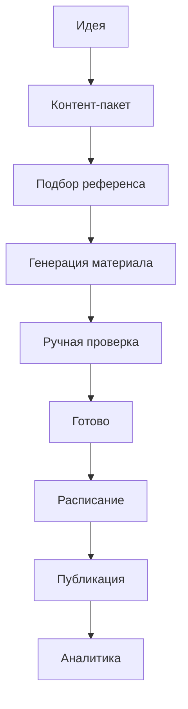

# Content Pipeline — архитектурный контракт

Статус: **03-A, контракт v1.0 (documentation only)**

Область: **03 — Контент-фабрика**

Дата: **2026-07-14**

Этот документ фиксирует единый жизненный цикл публикации Atlas AI OS: от идеи до аналитики. Он согласует контент-фабрику с `CHARACTER_BRAIN.md` и `REFERENCE_LIBRARY.md`, но не меняет текущий runtime, Supabase-схему, API, Modal или интерфейс. Целевые типы и статусы ниже являются контрактом для будущих узких PR, а не описанием уже внедрённой production-схемы.

## 1. Границы ответственности

Область 03 отвечает за:

- каноническую запись публикации и её редакционную ревизию;
- идею, контент-пакет, текст, platform/format и визуальное намерение;
- запуск подбора референса и визуального производства через область 02;
- ручную проверку и подтверждение конкретной ревизии материала;
- расписание, защиту от повторной публикации и связь с platform receipt;
- связь опубликованного материала с аналитикой;
- отображение единого состояния для календаря и команды.

Область 03 не отвечает за:

- изменение Character Brain и принятие новых фактов без отдельного подтверждения — область 01;
- выбор Storage URL, GPU-параметров, masks, IP-Adapter/InstantID, render cache и QA сцены — область 02;
- физическую Supabase-схему, RLS, секреты платформ, workers и очереди — область 05;
- визуальную декомпозицию экранов и компонентов — область 04.

## 2. Фактическое состояние `main`

Контракт подготовлен по `main` на коммите `92fc99c`.

Полной базовой DDL для `content_items` в репозитории нет. Текущий контракт таблицы восстанавливается по `src/app/dashboard.tsx`.

### 2.1. Текущие поля `content_items`

| Поле | Текущий тип в клиенте | Фактическое использование |
| --- | --- | --- |
| `id` | `string` | Идентификатор публикации |
| `model_id` | `string \| null` | Связь с `ai_models` |
| `title` | `string` | Рабочее название |
| `platform` | `string \| null` | Instagram, TikTok, YouTube Shorts или Telegram |
| `format` | `string \| null` | Reels, Карусель, Пост или Stories |
| `status` | `string` | Сейчас UI использует `draft`, `review`, `ready`, `published` |
| `caption` | `string \| null` | Склеенные hook, основной текст, CTA и hashtags |
| `visual_prompt` | `string \| null` | Склеенные positive и negative prompts |
| `shot_list` | `string[] \| null` | Покадровый сценарий |
| `publish_at` | `string \| null` | Дата в календаре; сейчас не доказывает, что материал согласован или опубликован |
| `asset_url` | `string \| null` | Прямая ссылка на одно изображение |
| `review_comment` | `string \| null` | Последний редакторский комментарий без истории |
| `created_by` | `string` | Автор записи |

В клиенте нет `owner_id`, revision, approval record, publish attempt, provider post ID, content hash, idempotency key, lineage или analytics link. До физической схемы область 05 должна проверить действующие RLS и tenant boundary; этот документ не утверждает, что они уже реализованы.

### 2.2. Текущие сценарии

- `/api/generate` получает полный клиентский объект модели и выполняет один OpenAI-запрос. Результат существует только в состоянии модального окна, пока пользователь не сохранит его как `draft`.
- `/api/plan-week` одним OpenAI-запросом создаёт семь публикаций. После подтверждения все семь вставляются как `draft`, но сразу получают `publish_at`.
- сцена создаётся через общий Avatar Studio. Готовый `output_url` можно сохранить в `model_references` и записать прямо в `content_items.asset_url`.
- календарь показывает любую запись с `publish_at`, независимо от `status`, approval и наличия материала.
- `published` выбирается вручную в dropdown; platform dispatch, receipt и аналитика отсутствуют.
- Supabase insert/update выполняются из клиента; ошибки большинства операций не показываются и переходы статусов server-side не проверяются.

## 3. Канонический путь публикации



1. **Идея.** Человек выбирает персонажа, цель, platform, format и тему либо создаёт недельный brief.
2. **Контент-пакет.** OpenAI получает versioned `ContentCharacterContextV1` и возвращает структурированный пакет. Человек редактирует результат; Character Brain автоматически не изменяется.
3. **Подбор референса.** Область 03 передаёт визуальное намерение в область 02 как `SceneReferenceQueryV1`. Права и допустимые зоны являются hard gate.
4. **Генерация материала.** Только после выбора versioned reference и cache preflight область 02 может поставить idempotent render request в Modal. Cache hit не запускает GPU.
5. **Проверка.** Человек проверяет текст, визуал, соответствие персонажу, disclosure, права и platform preview. `needs_review` или rejected render не может пройти дальше.
6. **Готово.** Человек явно подтверждает конкретную редакционную ревизию и её publish payload. Само наличие текста или картинки не является approval.
7. **Расписание.** Только подтверждённая ревизия связывается с platform account и временем. Изменение времени не меняет контент; изменение текста, visual, platform/account или disclosure аннулирует approval.
8. **Публикация.** Worker отправляет один immutable snapshot с устойчивым idempotency key. Успех подтверждается provider receipt или отдельным ручным подтверждением внешней публикации.
9. **Аналитика.** Метрики привязываются к provider post ID и опубликованной ревизии; они не изменяют исходный snapshot.

## 4. Три независимых автомата состояния

Статус публикации нельзя заменять статусом GPU job или platform request. Канонический экран агрегирует три независимых состояния.

| Автомат | Владелец | Примеры |
| --- | --- | --- |
| `content_items.status` | Область 03 | идея, редактура, approval, расписание, публикация |
| reference/render status | Область 02 | selection, queued, processing, accepted, rejected |
| publish attempt status | Область 03/05 | pending, dispatching, succeeded, failed, unknown |

Например, публикация может иметь `content_items.status = review`, а её render request — `completed + needs_review`. Она не становится `ready` автоматически.

## 5. Допустимые статусы публикации

```ts
type ContentStatusV1 =
  | "idea"
  | "draft"
  | "material_pending"
  | "review"
  | "ready"
  | "scheduled"
  | "publishing"
  | "published"
  | "publish_failed"
  | "archived";
```

| Статус | Смысл | Обязательные условия |
| --- | --- | --- |
| `idea` | Brief существует, контент-пакет ещё не принят | character, цель и тема |
| `draft` | Текстовый пакет создан или редактируется | title, platform, format, content package revision |
| `material_pending` | Текст пригоден для производства, визуал выбирается/создаётся | versioned visual intent; нет принятого output |
| `review` | Текст и материал собраны для проверки | previewable text, accepted/externally supplied asset, rights/disclosure summary |
| `ready` | Человек подтвердил текущую publish revision | active manual approval с совпадающим revision/hash |
| `scheduled` | Подтверждённый snapshot назначен на platform account и время | `ready`, `scheduled_at`, account, timezone, действующий approval |
| `publishing` | Один publish attempt получил dispatch lock | immutable snapshot и idempotency key |
| `published` | Платформа или человек подтвердили факт публикации | provider post ID/URL либо auditable manual receipt |
| `publish_failed` | Отправка не подтверждена | сохранён attempt, код ошибки и безопасный retry path |
| `archived` | Работа прекращена, история сохранена | новые generation/publish actions запрещены |

`cancelled` не нужен как отдельный конечный статус: отменённая идея или публикация архивируется с `archive_reason`. Удаление опубликованной истории запрещено; удаление поста с платформы фиксируется отдельным publication state/event.

### 5.1. Переходы

| Из | В | Кто выполняет | Gate |
| --- | --- | --- | --- |
| — | `idea` | человек/Supabase | валидный tenant и Character Brain reference |
| `idea` | `draft` | человек после OpenAI или вручную | структурированный пакет сохранён |
| `draft` | `material_pending` | человек | текст принят для visual production |
| `material_pending` | `review` | человек | выбран accepted output или разрешённый внешний asset |
| `review` | `draft` | человек | требуются изменения текста/концепции |
| `review` | `material_pending` | человек | требуется новый visual/reference |
| `review` | `ready` | человек | explicit approval текущей revision |
| `ready` | `scheduled` | человек/Supabase | account + время + approval |
| `scheduled` | `ready` | человек | снять с расписания без изменения контента |
| `scheduled` | `publishing` | worker | due time, budget/policy check, atomic dispatch lock |
| `publishing` | `published` | worker/Supabase | provider receipt или manual receipt |
| `publishing` | `publish_failed` | worker/Supabase | terminal/timeout result сохранён |
| `publish_failed` | `publishing` | человек/worker | retry того же logical attempt; новый дубль запрещён |
| любое, кроме `publishing` | `archived` | человек | причина и audit event |

Запрещены прямые переходы `idea|draft|material_pending|review → scheduled|publishing|published`, `ready → published` и произвольное выставление `published` через обычный status dropdown.

### 5.2. Изменения после подтверждения

Каждое изменение publish payload повышает `content_revision` и аннулирует approval. Publish payload включает:

- character revision и disclosure;
- platform, format и platform account;
- caption, hashtags, CTA, media set и их порядок;
- attribution и рекламную маркировку;
- ссылки/mentions и platform-specific options.

Изменение только `scheduled_at` или timezone создаёт новую schedule revision, но может сохранить approval, если publish payload hash не изменился. Любая замена asset, текста, platform/account, прав или disclosure возвращает запись минимум в `review`.

## 6. Статусы подбора и материала

Область 03 хранит ссылки и сводное состояние, но не дублирует внутренний автомат области 02.

```ts
type MaterialStateV1 =
  | "not_requested"
  | "selecting_reference"
  | "reference_ready"
  | "queued"
  | "processing"
  | "needs_review"
  | "accepted"
  | "rejected"
  | "failed"
  | "restricted";
```

- только `accepted` либо manually verified external asset разрешает переход публикации в `review`;
- `restricted` немедленно блокирует новое расписание и публикацию даже для ранее cached output;
- `rejected` не вызывает автоматический повтор GPU; человек меняет constraints/mask/reference либо явно создаёт вариант;
- текущие `generation_jobs.status = queued|processing|completed|failed` являются legacy transport status и не равны решению качества.

## 7. Статусы фактической публикации

```ts
type PublishAttemptStatusV1 =
  | "pending"
  | "dispatching"
  | "succeeded"
  | "failed_retryable"
  | "failed_terminal"
  | "unknown";
```

`unknown` используется при timeout после отправки: до повторной отправки worker обязан запросить состояние у provider по idempotency key/client reference. Нельзя считать timeout доказательством, что публикации нет.

## 8. Роли человека, OpenAI, Modal и Supabase

| Этап | Человек | OpenAI | Modal / область 02 | Supabase / backend |
| --- | --- | --- | --- | --- |
| Идея | задаёт цель, тему, platform, format | не вызывается | не вызывается | создаёт tenant-scoped idea и audit event |
| Контент-пакет | запускает запрос, редактирует/принимает | возвращает schema-validated draft | не вызывается | фиксирует input hash, output и revisions |
| Референс | уточняет сцену, выбирает из допустимых кандидатов | может только нормализовать текст без права выбрать asset | выполняет hard filters/ranking; GPU не запускает | хранит query, selection и rights verdict |
| Материал | подтверждает оценку стоимости/новый variant | не принимает решение качества | cache preflight, render, identity/scene QA | idempotency, dispatch lock, lineage и status |
| Проверка | проверяет text/visual/disclosure/rights | не подтверждает публикацию | предоставляет QA summary | хранит review events и revision |
| Готово | явно нажимает «Согласовать» | не участвует | не участвует | сохраняет approver, time, revision и payload hash |
| Расписание | выбирает account, время и timezone | может рекомендовать время, но не назначать | не участвует | валидирует approval, создаёт schedule revision |
| Публикация | заранее разрешает конкретный payload; при ручном режиме подтверждает URL | не участвует | не участвует | атомарный lock, provider dispatch, receipt и audit |
| Аналитика | смотрит результаты и решает, как менять стратегию | позже может суммировать только сохранённые метрики | не участвует | ingest/dedupe snapshots, связь с published revision |

OpenAI и Modal никогда не переводят публикацию в `ready`, `scheduled` или `published`. Клиент не передаёт доверенные `owner_id`, approval, rights verdict, provider receipt или Character Brain revision; backend получает и проверяет их server-side.

## 9. Межобластные payload

Все payload имеют `contract_version`, tenant определяется server-side, даты передаются в ISO 8601 UTC, а изменяемые snapshots получают revision/hash.

### 9.1. Область 01 → 03: контекст персонажа

Используется `ContentCharacterContextV1` из `CHARACTER_BRAIN.md`:

```ts
type CharacterContextRefV1 = {
  contract_version: "1.0";
  character_id: string;
  memory_revision: number;
  context: ContentCharacterContextV1;
  context_hash: string;
};
```

Контент-фабрика получает identity, immutable facts, voice, audience, approved memory, storyline, active brand relationships и visual direction. `created_by`, служебные поля, primary face URL и proposed memory events в текстовый генератор не передаются.

Область 03 не записывает Character Brain. `memory_proposals` из пакета остаются предложениями; принять их может только отдельный ручной workflow области 01. После успешной публикации область 03 передаёт `source_content_id` и опубликованную revision как доказуемый источник для такого предложения.

### 9.2. Область 03 → OpenAI: запрос контент-пакета

```ts
type ContentGenerationRequestV1 = {
  contract_version: "1.0";
  idempotency_key: string;
  content_item_id: string;
  content_revision: number;
  character: CharacterContextRefV1;
  brief: {
    topic: string;
    goal: string;
    platform: "Instagram" | "TikTok" | "YouTube Shorts" | "Telegram";
    format: "Reels" | "Карусель" | "Пост" | "Stories";
    campaign_id: string | null;
    week_plan_id: string | null;
  };
  recent_content: {
    content_item_id: string;
    title: string;
    semantic_fingerprint: string;
  }[];
};
```

`input_hash` вычисляется из canonical JSON без timestamps и idempotency key, но с Character Brain revision и generator model/prompt revision.

### 9.3. OpenAI → область 03: контент-пакет

```ts
type ContentPackageV1 = {
  contract_version: "1.0";
  title: string;
  strategy: string;
  hook: string;
  caption: string;
  cta: string;
  hashtags: string[];
  shot_list: string[];
  visual_intent: {
    action: string;
    location: string | null;
    framing: string;
    lighting: string[];
    wardrobe: string[];
    objects: string[];
    aesthetic: string[];
    forbidden: string[];
    generator_prompt: string;
    negative_prompt: string;
  };
  suggested_publish_time: string | null;
  alternatives: string[];
  memory_proposals: {
    fact: string;
    reason: string;
  }[];
};
```

OpenAI output — только draft. `suggested_publish_time` не создаёт schedule, а `memory_proposals` не меняют персонажа.

### 9.4. Область 03 → 02: подбор референса

Область 03 формирует `SceneReferenceQueryV1` из `REFERENCE_LIBRARY.md` и добавляет связь с редакционной ревизией:

```ts
type ContentReferenceRequestV1 = {
  contract_version: "1.0";
  idempotency_key: string;
  content_item_id: string;
  content_revision: number;
  character_id: string;
  character_revision: number;
  query: SceneReferenceQueryV1;
};
```

Контент-фабрика передаёт intent и ограничения, но не выбирает Storage path, reference version, masks, diffusion backend или GPU settings.

### 9.5. Область 02 → 03: результат подбора

```ts
type ReferenceSelectionResultV1 = {
  contract_version: "1.0";
  selection_id: string;
  content_item_id: string;
  content_revision: number;
  status: "ready" | "no_match" | "restricted";
  reference: {
    reference_id: string;
    reference_version_id: string;
    preview_url: string;
    score: number;
    score_breakdown: Record<string, number>;
    license_summary: string;
    attribution_required: boolean;
    attribution_text: string | null;
    allowed_change_summary: string[];
  } | null;
  rejection_reasons: string[];
};
```

`preview_url` является короткоживущим/разрешённым представлением, а не доверенным source path.

### 9.6. Область 03 → 02: визуальное производство

```ts
type ContentMaterialRequestV1 = {
  contract_version: "1.0";
  idempotency_key: string;
  content_item_id: string;
  content_revision: number;
  selection_id: string;
  character_id: string;
  character_revision: number;
  variant_nonce: string | null;
  purpose: "organic" | "advertising";
};
```

`variant_nonce = null` означает «вернуть существующий accepted/in-flight результат при том же fingerprint». Новый nonce разрешён только после явного действия человека и показа стоимости.

### 9.7. Область 02 → 03: результат материала

```ts
type ContentMaterialResultV1 = {
  contract_version: "1.0";
  content_item_id: string;
  content_revision: number;
  render_request_id: string;
  render_fingerprint: string;
  output_id: string | null;
  status: "accepted" | "needs_review" | "rejected" | "failed" | "restricted";
  preview_url: string | null;
  publish_asset_id: string | null;
  attribution: string | null;
  lineage_revision: string;
  qa_summary: {
    automatic_decision: "pass" | "needs_review" | "fail";
    human_decision: "accepted" | "rejected" | null;
    rejection_reasons: string[];
  };
};
```

Область 03 хранит `output_id`/`publish_asset_id`, а не принимает произвольный service-role Storage URL как доказательство готовности.

### 9.8. Область 03 → publication worker

```ts
type PublicationDispatchV1 = {
  contract_version: "1.0";
  owner_id: string; // только server-side
  publish_attempt_id: string;
  idempotency_key: string;
  content_item_id: string;
  content_revision: number;
  publish_payload_hash: string;
  approval: {
    approval_id: string;
    approved_revision: number;
    approved_payload_hash: string;
    approved_by: string;
    approved_at: string;
  };
  destination: {
    platform: string;
    platform_account_id: string;
  };
  payload: {
    caption: string;
    media_asset_ids: string[];
    attribution: string | null;
    disclosure: string[];
    scheduled_at: string;
  };
};
```

Worker отклоняет request, если approval hash не совпадает, права стали restricted, Character Brain/asset policy требует повторной проверки или уже существует succeeded attempt.

### 9.9. Публикация → аналитика

```ts
type PublicationReceiptV1 = {
  publication_id: string;
  content_item_id: string;
  content_revision: number;
  platform: string;
  platform_account_id: string;
  provider_post_id: string;
  public_url: string | null;
  published_at: string;
  receipt_source: "provider" | "manual";
};

type PublicationAnalyticsSnapshotV1 = {
  contract_version: "1.0";
  publication_id: string;
  provider_post_id: string;
  captured_at: string;
  window: "1h" | "24h" | "7d" | "30d" | "lifetime";
  metrics: {
    impressions: number | null;
    reach: number | null;
    views: number | null;
    likes: number | null;
    comments: number | null;
    shares: number | null;
    saves: number | null;
    clicks: number | null;
    watch_time_seconds: number | null;
  };
  provider_payload_hash: string;
};
```

Analytics относится к immutable published revision. Корректировка метрик создаёт новый snapshot, а не переписывает факт публикации.

## 10. Ручное подтверждение — обязательный hard gate

Публикация без ручного подтверждения запрещена независимо от качества OpenAI/Modal, наличия даты и статуса render job.

Approval должен содержать:

```ts
type ContentApprovalV1 = {
  id: string;
  content_item_id: string;
  content_revision: number;
  publish_payload_hash: string;
  decision: "approved" | "rejected" | "revoked";
  approved_by: string | null;
  approved_at: string | null;
  comment: string | null;
};
```

Инварианты:

1. Approval создаётся только явным действием авторизованного человека.
2. OpenAI, Modal, scheduler и webhook не могут создать `approved` decision.
3. `approved_by`, tenant и роль определяются server-side.
4. Approval действителен только для совпадающих `content_revision` и `publish_payload_hash`.
5. Изменение publish payload автоматически создаёт `revoked` event и возвращает материал в `review`.
6. Для advertising дополнительно обязательны rights, brand relationship и disclosure checks.
7. UI не должен представлять обычный status dropdown как эквивалент подтверждения.

## 11. Защита от повторной генерации

### 11.1. OpenAI

Ключ результата контента: (`owner_id`, `input_hash`, `generator_revision`).

- одинаковый completed request возвращает сохранённый пакет без нового API-вызова;
- queued/in-flight request возвращает тот же request ID;
- retry после transport failure использует тот же logical request и увеличивает attempt;
- «Создать другой вариант» добавляет `variant_nonce`, показывает ожидаемую стоимость и создаёт новый input hash;
- двойной клик защищается unique (`owner_id`, `idempotency_key`).

### 11.2. Modal

Применяется tenant-scoped render fingerprint из `REFERENCE_LIBRARY.md`:

- cache key только (`owner_id`, `render_fingerprint`);
- submit key только (`owner_id`, `idempotency_key`);
- completed + accepted возвращается без GPU;
- queued/processing присоединяет клиента к существующему request;
- failed retry не создаёт независимый logical request;
- rejected output не перегенерируется автоматически;
- новый вариант требует `variant_nonce` и подтверждение стоимости.

## 12. Защита от повторной публикации

`publish_idempotency_key` вычисляется server-side из:

```text
owner_id + content_item_id + content_revision + publish_payload_hash + platform_account_id
```

Точное расписание хранится в attempt, но изменение времени до dispatch не создаёт право опубликовать тот же payload дважды.

Обязательные меры:

1. unique (`owner_id`, `publish_idempotency_key`);
2. атомарный переход `scheduled → publishing` и единственный dispatch lock;
3. сохранение provider client reference/idempotency key до network call;
4. сохранение `provider_post_id` и receipt после успеха;
5. при timeout — provider lookup, затем `unknown`; слепой повтор запрещён;
6. webhook events дедуплицируются по provider event ID;
7. retry использует тот же logical attempt и key;
8. повторная публикация как отдельная бизнес-операция требует clone/repost action, новой content revision и явного approval;
9. manual mode требует URL/ID и подтверждение человека; обычный выбор `published` не является receipt.

## 13. Существующие дублирующие и опасные действия интерфейса

Этот раздел фиксирует наблюдения, но не меняет UI в задаче 03-A.

| Действие сейчас | Где дублируется/конфликтует | Целевое правило |
| --- | --- | --- |
| Создать один материал | глобальная кнопка «Создать», CTA на главной и «Один материал» в студии открывают один modal | одна команда create с разными entry points, единый draft/idempotency key |
| Изменить статус | dropdown в списке, dropdown в PublicationDialog и кнопки согласования | transitions только через разрешённые actions; approval отдельным auditable действием |
| Отметить `published` | доступно в обоих dropdown без platform receipt | только publish workflow или manual receipt |
| Назначить дату | ContentDialog, PublicationDialog и WeekPlanner | единый schedule action только после approval; suggested time не равно schedule |
| Показать в календаре | любая запись с `publish_at`, даже `draft` | календарь различает tentative suggestion и настоящий `scheduled` |
| Прикрепить визуал | ручной URL в PublicationDialog и attach готовой сцены в Avatar Studio | единый asset picker по `publish_asset_id` с rights/lineage |
| Сохранить сцену | сначала в `model_references`, затем отдельно в `content_items.asset_url` | один accepted output может быть связан через usage без копирования URL |
| Сгенерировать неделю | семь записей сразу получают `publish_at`, но остаются `draft` | week plan создаёт drafts и schedule suggestions; подтверждение каждой/группы остаётся ручным |
| Редактировать контент | текст, visual prompt и status сохраняются одной update-операцией | изменение payload создаёт revision и отзывает старый approval |

Дополнительные расхождения текущего UI:

- `caption` склеивает hook, caption, CTA и hashtags, поэтому platform adaptation и точное хеширование затруднены;
- `visual_prompt` склеивает positive и negative prompt;
- `strategy`, `best_time`, `alternatives`, `goal`, week theme и campaign lineage после генерации частично теряются;
- `review_comment` хранит последнее значение вместо журнала решений;
- один `asset_url` не поддерживает carousel/media ordering;
- нет отдельных состояний `scheduled`, `publishing`, `publish_failed`, receipt и analytics;
- прямые client-side update позволяют попытаться перескочить любой gate, если backend/RLS это не запрещает.

## 14. Предлагаемые логические сущности

Физическую схему и миграции проектирует область 05 отдельным PR.

| Сущность | Назначение |
| --- | --- |
| `content_items` | корень, character link, status, current revision |
| `content_revisions` | immutable brief/content package/publish payload snapshots и hashes |
| `content_generation_requests` | OpenAI input hash, idempotency, attempts, model/prompt revision, cost |
| `content_material_links` | selection/render/output/publish asset, rights, attribution и usage |
| `content_reviews` | комментарии и review decisions как события |
| `content_approvals` | ручное подтверждение конкретной revision/hash |
| `content_schedules` | account, timezone, scheduled_at, schedule revision |
| `publication_attempts` | dispatch lock, idempotency, provider request/receipt/error |
| `publications` | подтверждённый provider post и published revision |
| `publication_analytics` | versioned metric snapshots |

Все сущности tenant-scoped. История не удаляется каскадно после публикации; используются archive/restrict и retention policy.

## 15. Инварианты безопасности и воспроизводимости

- `owner_id` определяется server-side и присутствует во всех lookup/unique constraints.
- Клиент не может подтвердить чужую запись, material output, platform account или receipt.
- Каждый published post восстанавливается до Character Brain revision, content revision, reference version, render output, approval и publication receipt.
- Restricted/revoked rights блокируют будущий dispatch и требуют реакции на уже опубликованный материал.
- OpenAI/Modal output не становится фактом памяти или публикацией автоматически.
- Scheduler не создаёт контент и не меняет approval.
- Platform webhook не может подменить content revision; он связывается с известным attempt/client reference.
- Ошибка аналитики не откатывает факт публикации.
- Build, CI и документационные проверки не запускают OpenAI или GPU.

## 16. Совместимость и будущий переход

До внедрения целевой схемы:

- `draft` отображает `idea|draft|material_pending` по контексту, но не считается approval;
- `review` соответствует целевому `review` только при наличии проверяемого материала;
- текущий `ready` следует считать UI-маркером, пока нет approval record/revision/hash;
- `publish_at` является tentative временем, пока нет `status = scheduled` и schedule record;
- текущий `published` является ручной меткой, пока нет provider/manual receipt;
- `asset_url` остаётся legacy link, а новые контракты должны переходить к `output_id`/`publish_asset_id`;
- `generation_jobs` и `model_references` остаются legacy transport/library tables до миграции области 02/05.

Нельзя массово преобразовать существующие `ready` в approved или `published` в подтверждённые публикации без ручной сверки.

## 17. Этапы будущей реализации

Этот PR не реализует этапы ниже.

1. Согласовать статусы, payload и границы с областями 01, 02 и 05.
2. Добавить server-side content service и полную tenant-scoped схему с revisions/audit.
3. Ввести OpenAI request idempotency и сохранение структурированного пакета без UI-редизайна.
4. Подключить `SceneReferenceQueryV1`, accepted output и usage link вместо прямого URL.
5. Реализовать ручной approval gate и разрешённые переходы статусов.
6. Отделить schedule suggestion от подтверждённого schedule.
7. Добавить idempotent publication attempts и provider/manual receipts.
8. Подключить analytics snapshots только после появления подтверждённой публикации.
9. После backend invariants устранить дубли UI отдельным PR области 04.

## 18. Definition of Done для Content Pipeline v1

Content Pipeline v1 считается реализованным только когда:

- каждый content item имеет versioned Character Brain context и immutable content revisions;
- OpenAI и Modal защищены tenant-scoped idempotency/cache до платного вызова;
- reference selection, accepted output, rights, attribution и lineage связаны с content revision;
- manual approval нельзя подменить статусом, датой, AI-решением или client payload;
- изменение publish payload отзывает approval;
- scheduled item имеет account, timezone, due time и действующий approval;
- один logical publish request не создаёт два platform posts даже при retry/timeout/webhook race;
- `published` подтверждён receipt и связан с immutable revision;
- analytics привязана к provider post ID и versioned snapshots;
- существующие записи мигрированы без ложного признания `ready/published` подтверждёнными;
- CI/build проверки не расходуют OpenAI/Modal бюджет.
