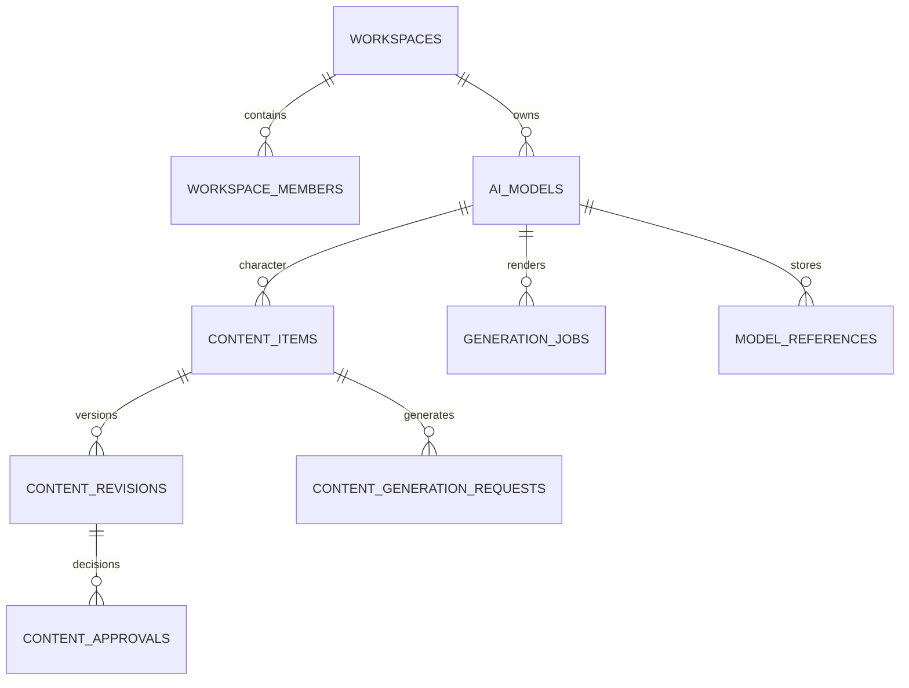

# Atlas Data Model — минимальная физическая модель

Статус: **05-A, контракт v1.0 (documentation only)**

Область: **05 — Backend и инфраструктура**

Дата: **2026-07-14**

Этот документ согласует минимальную физическую модель первого этапа для Atlas AI OS. Он не является migration-файлом и не утверждает, что целевые поля уже существуют в production. Документ не меняет Supabase, Storage, RLS, runtime, API, Modal или интерфейс.

Контракт сводит требования `CHARACTER_BRAIN.md`, `REFERENCE_LIBRARY.md`, `CONTENT_PIPELINE.md` и `UI_MODULES.md`, но сознательно не реализует всю будущую архитектуру сразу.

## 1. Границы и источник фактов

Фактическое состояние восстановлено по `main` на коммите `83d1b27`, двум SQL migrations и обращениям runtime. Прямой schema dump production в репозитории отсутствует, поэтому таблицы `profiles`, `ai_models` и `content_items` ниже считаются **наблюдаемыми production-зависимостями**, а не полной подтверждённой DDL.

Перед первой реальной migration обязателен read-only inventory production: таблицы, колонки, типы, defaults, constraints, indexes, triggers, RLS policies, bucket policies и количество строк. Расхождение inventory с этим документом останавливает migration и требует обновления плана; production нельзя «подгонять» под предположение.

## 2. Существующее состояние и пробелы migrations

### 2.1. Таблицы и объекты, которые использует runtime

| Объект | Наблюдаемые поля/назначение | Зафиксирован в migrations |
| --- | --- | --- |
| `auth.users` | Supabase Auth, `auth.uid()` | Управляется Supabase |
| `profiles` | `id`, `email`, `role`, `created_at`; роль читается при входе и список команды читается клиентом | Нет |
| `ai_models` | `id`, `name`, `handle`, `niche`, `bio`, `status`, `visual_passport`, `created_by`, `created_at` | Нет |
| `content_items` | `id`, `model_id`, `title`, `platform`, `format`, `status`, `caption`, `visual_prompt`, `shot_list`, `publish_at`, `asset_url`, `review_comment`, `created_by`, `created_at` | Нет |
| `generation_jobs` | Очередь `avatar/scene`, prompt/style/count, transport status, provider IDs, `output_urls`, error и timestamps | Да |
| `model_references` | Материалы модели: `candidate/primary/reference`, `storage_path`, legacy job link и audit | Да |
| `storage.buckets/objects` | Публичный bucket `atlas-assets`; Modal пишет `avatars/{model_id}/{job_id}-{index}-{random}.jpg` | Частично |

`visual_passport` сейчас является плоским JSON и содержит Character Brain legacy-поля. `visual_passport.avatar` и `model_references.kind = 'primary'` дублируют указатель на эталонное лицо; runtime считает каноническим `visual_passport.avatar`.

`model_references.storage_path` фактически может содержать полный public URL, несмотря на название поля. Это нельзя молча трактовать как относительный Storage path при backfill.

### 2.2. Критические пробелы репозитория

- Нет воспроизводимой базовой DDL для `profiles`, `ai_models` и `content_items`.
- Нет зафиксированного tenant/workspace и `owner_id` у доменных строк.
- Текущие policies позволяют любому authenticated пользователю читать все `generation_jobs` и `model_references`.
- `created_by` обозначает автора действия, но не является tenant boundary.
- `atlas-assets` имеет `public = true`; object SELECT policy не ограничивает получение известного public URL.
- Нет гарантии единственного `model_references.kind = 'primary'` на персонажа.
- Нет immutable content revisions, проверяемого approval, idempotency OpenAI/Modal и tenant-scoped cache fingerprint.
- Нет versioned Storage provenance: bucket/path, hash, rights, source и accepted/public derivative не разделены.
- Нет полной схемы schedules, publication receipts и analytics; текущий `published` является ручной UI-меткой.

## 3. Tenant-модель и смысл `owner_id`

### 3.1. Решение

`owner_id` — это **ID workspace/tenant**, а не ID пользователя. Он ссылается на `workspaces.id`. Один пользователь может состоять в нескольких workspace, а один workspace — иметь нескольких участников.

`created_by`, `updated_by`, `approved_by` и `reviewed_by` всегда ссылаются на `auth.users.id` и отвечают на вопрос «кто выполнил действие». Они не заменяют `owner_id`.

Клиент не является источником истины для tenant. Server-side command получает workspace из авторизованного контекста и проверенного membership. Если переходный клиент передаёт `owner_id`, RLS обязана проверить membership; значение из body нельзя использовать без проверки.

### 3.2. Минимальные tenant-таблицы

#### `workspaces`

| Поле | Тип/правило |
| --- | --- |
| `id` | uuid PK |
| `name` | text not null |
| `status` | text: `active \| suspended \| archived` |
| `created_by` | uuid FK `auth.users` |
| `created_at`, `updated_at` | timestamptz |

#### `workspace_members`

| Поле | Тип/правило |
| --- | --- |
| `owner_id` | uuid FK `workspaces`, часть PK |
| `user_id` | uuid FK `auth.users`, часть PK |
| `role` | text: `owner \| editor \| viewer` |
| `status` | text: `active \| invited \| disabled` |
| `created_at`, `updated_at` | timestamptz |

Primary key: (`owner_id`, `user_id`). Авторитетная tenant-role после cutover хранится здесь. `profiles.role` временно остаётся legacy-полем для совместимости UI, но не используется как глобальное право пользователя во всех workspace.

`profiles` остаётся user-level профилем и является осознанным исключением из правила «каждая доменная строка содержит `owner_id`». Видимость чужих профилей разрешается только через общее активное membership.

## 4. Минимальная физическая модель первого этапа

Первый этап сохраняет работающие таблицы и добавляет только сущности, без которых нельзя обеспечить tenant isolation, reproducibility, approval и экономную идемпотентность.



### 4.1. Существующие таблицы, которые расширяются

#### `ai_models`

Существующие поля сохраняются. Добавляются:

| Поле | Правило |
| --- | --- |
| `owner_id` | uuid not null FK `workspaces` после backfill |
| `revision` | integer not null default 1, повышается при изменении Character Brain/visual identity |
| `updated_at`, `updated_by` | audit |

`visual_passport` остаётся JSONB-источником Character Brain v1 на первом этапе. Нормализация immutable facts, memory events, voice и brand relationships сейчас не выполняется.

Для tenant-safe relations добавляется unique (`owner_id`, `id`), даже если `id` уже глобально уникален. Переходы `draft/active/archived` выполняются server-side; archived character не принимает новые generation requests.

#### `content_items`

Legacy-колонки сохраняются для текущего UI. Добавляются:

| Поле | Правило |
| --- | --- |
| `owner_id` | uuid not null FK `workspaces` после backfill |
| `current_revision_id` | uuid nullable, указывает на принятую текущую `content_revisions` |
| `updated_at`, `updated_by` | audit |
| `archive_reason` | text nullable |

`content_items` остаётся mutable root и хранит lifecycle/status. Текст, visual intent и publish payload, которые требуется воспроизвести, хранятся в immutable revision. До runtime cutover legacy `caption`, `visual_prompt`, `shot_list`, `asset_url`, `publish_at` и `review_comment` продолжают читаться как раньше.

`model_id` должен стать tenant-safe FK (`owner_id`, `model_id`) → `ai_models(owner_id, id)`. Старые `ready` и `published` нельзя автоматически считать approved или подтверждённо опубликованными.

#### `generation_jobs`

Таблица остаётся transport/request bridge для Modal в MVP. Добавляются:

| Поле | Правило |
| --- | --- |
| `owner_id` | uuid not null; выводится через `ai_models` |
| `idempotency_key` | text nullable на переходе |
| `render_fingerprint` | text nullable; только для запросов с достаточным versioned input |
| `character_revision` | integer nullable |
| `content_item_id`, `content_revision_id` | uuid nullable lineage |
| `variant_key` | text not null default `''` |
| `attempt`, `max_attempts` | integer, controlled retry |
| `dispatch_lock_at` | timestamptz nullable |
| `estimated_cost`, `actual_cost` | numeric nullable, currency/provider metadata отдельно |

Constraints после очистки данных:

- unique (`owner_id`, `idempotency_key`) where `idempotency_key is not null`;
- unique (`owner_id`, `render_fingerprint`) where `render_fingerprint is not null`;
- tenant-safe FK к `ai_models` и, при наличии, `content_items/content_revisions`;
- worker update обязан включать одновременно `id` и `owner_id`.

Legacy jobs без полного versioned input получают `render_fingerprint = null`: им нельзя приписывать cache hit задним числом. Retry меняет `attempt` той же logical row; новый вариант меняет `variant_key` и fingerprint только после явного действия пользователя.

#### `model_references`

Существующие записи не переименовываются и не удаляются. Добавляются:

| Поле | Правило |
| --- | --- |
| `owner_id` | uuid not null; выводится через `ai_models` |
| `storage_bucket` | text nullable для новых записей |
| `object_path` | text nullable для новых относительных paths |
| `sha256` | text nullable до безопасного hash backfill |
| `status` | `draft \| ready \| restricted \| archived` |
| `updated_at`, `updated_by` | audit |

`storage_path` сохраняется как legacy locator. Новые trusted записи используют пару (`storage_bucket`, `object_path`); URL выдаётся отдельно и не сохраняется как identity объекта.

После сверки дублей вводится unique (`owner_id`, `model_id`) where `kind = 'primary'`. Выбор primary остаётся явным действием; старый primary переводится в `reference`, а не удаляется.

### 4.2. Новые MVP-таблицы

#### `content_revisions`

Immutable snapshot контента и контекста генерации.

| Поле | Тип/назначение |
| --- | --- |
| `id` | uuid PK |
| `owner_id` | uuid not null |
| `content_item_id` | uuid not null |
| `revision` | integer not null, начинается с 1 |
| `character_id`, `character_revision` | воспроизводимый Character Brain link |
| `character_snapshot` | jsonb минимального server-side контекста |
| `brief`, `content_package`, `visual_intent` | jsonb versioned payloads |
| `publish_payload` | jsonb: platform, format, text, ordered media IDs, attribution, disclosure и options |
| `publish_payload_hash` | text SHA-256 canonical JSON |
| `created_by`, `created_at` | audit |

Constraints: unique (`owner_id`, `content_item_id`, `revision`), unique (`owner_id`, `id`), tenant-safe FKs. UPDATE/DELETE запрещены обычным ролям. Новая редактура создаёт следующую revision транзакционно и меняет `content_items.current_revision_id`.

#### `content_approvals`

Ручное решение по конкретной immutable revision.

| Поле | Тип/назначение |
| --- | --- |
| `id` | uuid PK |
| `owner_id` | uuid not null |
| `content_item_id`, `content_revision_id` | tenant-safe links |
| `publish_payload_hash` | hash, который должен совпасть с revision |
| `decision` | `approved \| rejected \| revoked` |
| `comment` | text nullable |
| `decided_by`, `decided_at` | только авторизованный человек и server timestamp |
| `decision_sequence` | bigint generated identity; детерминированный порядок решений |
| `supersedes_approval_id` | uuid nullable для нового решения |
| `idempotency_key` | text not null для double-click/retry |

Constraints: unique (`owner_id`, `idempotency_key`), unique (`owner_id`, `decision_sequence`) и tenant-safe self-FK `supersedes_approval_id`. Действующим считается head цепочки с максимальным `decision_sequence` для той же revision/hash, только если его decision = `approved`; `rejected` или `revoked` закрывает предыдущий approval. OpenAI, Modal, scheduler и webhook не могут создавать approval. Изменение publish payload создаёт новую revision; старый approval остаётся в истории, но перестаёт быть действующим.

#### `content_generation_requests`

Idempotent OpenAI request и cache без повторного платного вызова.

| Поле | Тип/назначение |
| --- | --- |
| `id` | uuid PK |
| `owner_id` | uuid not null |
| `content_item_id` | uuid not null |
| `base_revision` | integer not null |
| `idempotency_key` | text not null |
| `input_hash` | SHA-256 canonical input |
| `generator_revision` | model + prompt/schema revision |
| `variant_key` | text not null default `''` |
| `status` | `queued \| processing \| completed \| failed \| cancelled` |
| `attempt`, `max_attempts` | controlled retry |
| `dispatch_lock_at` | один API dispatch |
| `output_payload`, `error` | jsonb/text nullable |
| `estimated_cost`, `actual_cost` | numeric nullable |
| `created_by`, timestamps | audit |

Constraints:

- unique (`owner_id`, `idempotency_key`);
- unique (`owner_id`, `input_hash`, `generator_revision`, `variant_key`);
- tenant-safe FK к `content_items`.

Completed request возвращает сохранённый payload; queued/processing возвращает тот же request ID; retry повышает attempt той же row. «Другой вариант» получает новый non-empty `variant_key` после явного подтверждения стоимости.

## 5. Revisions, approval, idempotency и cache fingerprint

### 5.1. Revision rules

- `ai_models.revision` повышается при изменении immutable facts, memory, voice, seed, blueprint или primary identity reference.
- `content_revisions` immutable; любое изменение publish payload создаёт следующую revision.
- Изменение только времени/таймзоны в будущем создаёт schedule revision, но schedules не входят в MVP.
- Published/audited snapshot никогда не переписывается.
- Revision создаётся и становится current в одной транзакции с optimistic check предыдущей revision.

### 5.2. Canonical hash

Hash вычисляется server-side от UTF-8 canonical JSON: ключи объектов отсортированы, отсутствующие optional values нормализованы по schema, числа и строки имеют единое представление, timestamps/audit/idempotency key не входят. В hash обязательно входят contract/schema revision и IDs/revisions всех влияющих inputs.

`publish_payload_hash` включает character revision/disclosure, platform/format/account intent, caption/CTA/hashtags, ordered media IDs, attribution, advertising disclosure и platform options.

### 5.3. Render fingerprint

`render_fingerprint` включает:

- owner-independent параметры render: reference content hash/version, Character Brain revision, primary identity reference hash, canonical render plan/prompt/negative prompt;
- mode, pipeline/model revision, dimensions, seed, masks/change policies и `variant_key`.

Сам hash может совпасть у двух tenants, поэтому cache key всегда только (`owner_id`, `render_fingerprint`). Submit key всегда (`owner_id`, `idempotency_key`). Ни lookup, ни output, ни signed URL нельзя получать только по fingerprint.

Пока reference version/hash и Character Brain revision неизвестны, fingerprint не создаётся и cache miss считается обязательным. Это безопаснее ложного переиспользования.

## 6. RLS и доверенные операции

### 6.1. Общие правила

1. RLS включена и forced для всех tenant-domain tables после проверенного cutover.
2. SELECT требует активного `workspace_members(owner_id, auth.uid())`.
3. INSERT требует active role `owner/editor`; `created_by = auth.uid()`.
4. Обычный UPDATE не может менять `owner_id`, audit identity, hashes, approval, cost, dispatch lock или trusted status transitions.
5. DELETE заменяется archive/restrict; hard delete разрешается только для подтверждённо неиспользуемого draft по отдельной policy/RPC.
6. Viewer имеет только SELECT и не запускает платные операции.
7. Cross-table relation валидируется composite FK (`owner_id`, foreign_id), а не только RLS каждой таблицы.

### 6.2. Команды повышенного доверия

Approval, revision increment, cache registration/dispatch lock и status transitions выполняются server-side transaction/RPC. SECURITY DEFINER функции, если используются, имеют фиксированный `search_path`, проверяют `auth.uid()`, membership/role и не принимают trusted actor/owner из body.

Modal использует service role и технически обходит RLS, поэтому worker обязан обновлять row по (`owner_id`, `job_id`) и не выполнять глобальный lookup по fingerprint/idempotency. В более позднем этапе service role заменяется узким worker RPC/credential.

### 6.3. Минимальная матрица доступа

| Сущность | Viewer | Editor | Owner | Worker/service |
| --- | --- | --- | --- | --- |
| Character/content/reference read | Свой workspace | Свой workspace | Свой workspace | Только переданный owner/request |
| Draft create/edit | Нет | Да | Да | Нет |
| Approval | Нет | Да, если политика workspace разрешает | Да | Запрещено |
| Paid generation dispatch | Нет | Через server command + budget gate | Через server command + budget gate | Исполняет locked request |
| Membership/tenant settings | Нет | Нет | Да | Нет |

## 7. Storage: private и public paths

### 7.1. Legacy

`atlas-assets` остаётся legacy public bucket до появления server-side signed URL adapter. Нельзя переключать его на private одним DDL: текущие `visual_passport.avatar`, `model_references.storage_path`, `content_items.asset_url` и Modal `get_public_url()` перестанут работать.

Новые записи после cutover не должны сохранять случайный public URL как object identity.

### 7.2. Целевые buckets MVP

Private bucket `atlas-private`:

```text
references/{owner_id}/{reference_id}/v{version}/original.{ext}
references/{owner_id}/{reference_id}/v{version}/preview.webp
references/{owner_id}/{reference_id}/v{version}/masks/{region_id}.png
references/{owner_id}/{reference_id}/v{version}/license/{document}
renders/{owner_id}/{request_id}/{output_id}.{ext}
```

Originals, identity references, source scenes, masks, license documents, drafts и rejected outputs всегда private. Доступ — короткоживущий signed URL только после tenant check. Object policies извлекают `owner_id` из path и проверяют membership; upload/delete выполняются server/worker, не произвольным клиентским path.

Public bucket `atlas-public`:

```text
published/{owner_id}/{content_item_id}/r{revision}/{asset_id}.{ext}
```

Public объект — отдельная accepted derivative, созданная после rights/approval checks. Public copy не заменяет private original и хранит lineage/hash в БД. License documents, masks и исходные референсы никогда не публикуются.

## 8. Совместимость legacy → MVP

| Legacy | MVP-источник истины | Правило совместимости |
| --- | --- | --- |
| `ai_models.visual_passport` | То же JSONB + `ai_models.revision` | Не нормализовать в первом этапе; adapter формирует Character Brain v1 |
| `visual_passport.avatar` | Legacy canonical URL | Сохранять до atomic cutover на verified primary reference |
| `model_references.kind = primary` | Единственный primary в tenant/model scope | Сначала сверить с avatar и дубли, затем unique partial constraint |
| `content_items` legacy fields | `content_items` + immutable `content_revisions` | Создать revision 1 snapshot; legacy columns остаются read-compatible |
| `ready` | Не доказанный approval | Не создавать approved record автоматически |
| `published` | Не доказанный receipt | Сохранить legacy status/flag, но не создавать provider publication |
| `publish_at` | Tentative legacy date | Не считать confirmed schedule |
| `generation_jobs` | Modal request bridge | Backfill owner; fingerprint только для новых versioned inputs |
| `output_urls[]` | Legacy output locators | Не переносить в public без owner/rights/hash verification |
| `model_references.storage_path` | Legacy locator или bucket/path | Определить URL vs path по inventory, не обрезать строку эвристически |

## 9. Безопасный порядок будущих migrations

Каждый шаг — отдельная reversible migration/PR с backup, row-count checks и dry-run на staging. Runtime cutover выполняется отдельно от DDL.

1. **Inventory и backup.** Снять schema/policy dump, bucket inventory, counts и orphan report. Зафиксировать production commit и rollback owner.
2. **Additive tenant core.** Создать `workspaces`, `workspace_members`, helper membership functions и indexes, не меняя текущие policies.
3. **Seed tenant.** Создать один Atlas workspace; сопоставить существующих пользователей через `profiles`. Неизвестные/дублирующиеся memberships отправить в quarantine report.
4. **Nullable ownership.** Добавить nullable `owner_id` и audit/revision bridge-поля в domain tables. Backfill: `ai_models` по `created_by`; зависимые rows — через parent model/content, а не независимо по автору.
5. **Проверка backfill.** Ноль orphan/cross-owner links, ноль неожиданных null, counts и hashes до/после совпадают. Ambiguous rows не удалять.
6. **Composite integrity.** Добавить unique (`owner_id`, `id`) и tenant-safe FKs сначала `NOT VALID`, затем `VALIDATE CONSTRAINT`. Только после успешной проверки установить `owner_id NOT NULL`.
7. **RLS shadow/canary.** Добавить новые owner-scoped policies и server commands; проверить owner/editor/viewer, two-tenant negative tests и worker scope. Старые broad policies удалять только в той же транзакции cutover.
8. **Content history.** Создать `content_revisions`, `content_approvals`, `content_generation_requests`. Backfill revision 1 из legacy content без ложных approval/receipt. Переключить writes server-side, затем reads.
9. **Modal bridge safety.** Ввести idempotency/dispatch fields и partial unique indexes на `generation_jobs`; старым jobs оставить fingerprint null. Никаких GPU-запусков при backfill.
10. **Reference integrity.** Backfill `model_references.owner_id`, классифицировать locator, найти duplicate primary, вычислять hashes фоново без перезаписи objects. Затем добавить primary constraint.
11. **Private Storage rollout.** Создать новые buckets/policies, внедрить signed URL и dual-read. Новые uploads направить в private paths; старые public URLs пока читать.
12. **Object migration.** Копировать, hash-verify и связать legacy objects; не удалять originals. Public derivative создавать только после approval/rights checks.
13. **Cutover и наблюдение.** Метрики RLS denial, idempotency hit, duplicate dispatch, signed URL errors и cost. Сохранить rollback window.
14. **Legacy freeze позже.** Удалять legacy columns/policies/bucket только отдельным PR после подтверждённого отсутствия readers и резервной копии.

Запрещены: массовое destructive rewrite, `DROP` в первом этапе, включение `NOT NULL` до backfill, изменение bucket public/private без runtime adapter и вывод approval/publication из legacy status.

## 10. Что входит в MVP, а что откладывается

### MVP / первый этап

- `workspaces`, `workspace_members`, tenant-scoped `owner_id` и RLS;
- сохранение `profiles`, `ai_models`, `content_items`, `generation_jobs`, `model_references`;
- `ai_models.revision` при сохранении `visual_passport`;
- immutable `content_revisions` и проверяемый ручной `content_approvals`;
- `content_generation_requests` для OpenAI idempotency/cache/cost metadata;
- owner-scoped idempotency, fingerprint и dispatch lock в legacy `generation_jobs`;
- единственный primary reference после data audit;
- private source/render Storage и отдельная public accepted derivative;
- composite tenant FKs, audit actor и server-side trusted commands.

### Отложено

- полная нормализация Character Brain: immutable facts, memory events, brand relationships и character revision table;
- `reference_assets`, versions, regions, rights, embeddings, отдельные render requests/outputs и usage graph;
- vector/semantic search и автоматический reference ranking;
- полноценные `content_reviews`, material links и event ledger;
- schedules, platform accounts, publication attempts, receipts, webhooks и analytics snapshots;
- автоматическая публикация, multi-platform dispatch и provider reconciliation;
- общий финансовый ledger, quotas/billing и сложные retention tiers;
- удаление legacy JSON/URL/status columns.

Отложенная сущность добавляется только когда появляется runtime-сценарий и отдельный migration/API PR. Документ не даёт разрешения создавать все перечисленные таблицы заранее.

## 11. Обязательные инварианты реализации

- Ни одна tenant-domain row не читается или связывается без `owner_id`.
- Cross-owner FK, cache hit, idempotency hit, signed URL и service-role lookup запрещены.
- `created_by` не используется как замена tenant.
- OpenAI/Modal output не создаёт approval и не меняет Character Brain автоматически.
- Approval всегда относится к точной immutable revision и совпадающему payload hash.
- Retry не создаёт новый платный logical request; новый variant явный и учитываемый.
- Private source никогда не становится public простым изменением bucket policy.
- Backfill не делает legacy `ready/published` более доверенным, чем он был.
- Любая реальная migration имеет staging evidence, rollback и two-tenant negative tests.

## 12. Definition of Done для будущего MVP schema PR

MVP physical schema считается внедрённой только когда:

- schema dump позволяет поднять новую Supabase-среду без ручного создания core tables;
- все существующие строки сопоставлены tenant или явно помещены в quarantine без удаления;
- owner/editor/viewer и второй tenant проверены автоматическими RLS tests;
- runtime сохраняет legacy UX во время перехода;
- `npm ci`, build и CI проходят без OpenAI/Modal GPU;
- duplicate OpenAI/Modal submit не создаёт второй paid dispatch;
- approval нельзя создать статусом, клиентским actor/owner или AI/worker;
- private/public Storage paths и signed URL boundary проверены;
- production cutover имеет мониторинг и документированный rollback.
